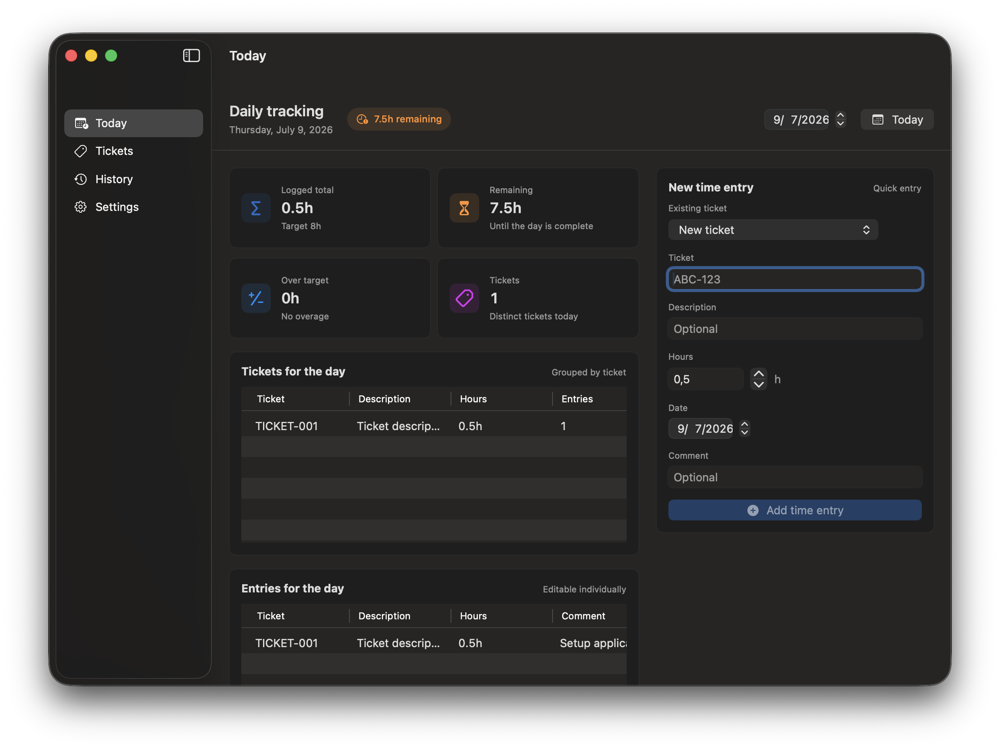

# Tracking Hours

SwiftUI macOS app for tracking daily Jira ticket time entries.

## Screenshot



## Features

- Main view for the selected day, defaulting to today.
- Quick time entry with ticket, description, hours, date, and comment.
- Reusable local ticket catalog so existing ticket codes do not need to be retyped.
- Create tickets with no time entries so they are ready before work is logged.
- Close, restore, and delete tickets from the ticket library.
- Edit and delete individual entries.
- Double-click ticket or entry rows to open a detail window.
- Grouped ticket summary with total hours per ticket.
- Daily totals: logged hours, remaining hours, overage, and distinct ticket count.
- History view by day with total, balance, and distinct tickets.
- Settings for daily target hours, reminder time, workdays, and notifications.
- Local JSON persistence in Application Support.
- Local notification on workdays when configured reminder time arrives and hours are missing.
- Native macOS app icon and accent color assets.

## Structure

```text
tracking_hours/
  Models/
    AppSettings.swift
    DetailPayloads.swift
    JiraTicket.swift
    SummaryModels.swift
    TimeEntry.swift
  Services/
    LocalJSONPersistence.swift
    NotificationService.swift
    TimeTrackerStore.swift
  Utilities/
    Formatters.swift
    Weekdays.swift
  Views/
    Components.swift
    ContentView.swift
    HistoryView.swift
    SettingsView.swift
    TicketLibraryView.swift
    TodayView.swift
  tracking_hoursApp.swift
```

## Build And Run

1. Open `tracking_hours.xcodeproj` in Xcode.
2. Select the `tracking_hours` scheme.
3. Run with `Cmd+R`.

You can also build from Terminal:

```bash
xcodebuild -project tracking_hours.xcodeproj -scheme tracking_hours -configuration Debug build
```

The built app product is named `Jira Hours.app`.

## Local Data

The JSON file is stored in Application Support, inside the app sandbox when run from Xcode. The Settings screen shows the exact file path.

## Notifications

The app requests notification permission when reminders are enabled. Whenever entries or settings change, it reschedules upcoming workday reminders. If the selected day already reaches the target, no reminder is scheduled for that day.

This first version does not integrate with Jira or Tempo yet, but the core logic is centralized in `TimeTrackerStore`, so future sync can import, create, or update `TimeEntry` values without rewriting the interface.
